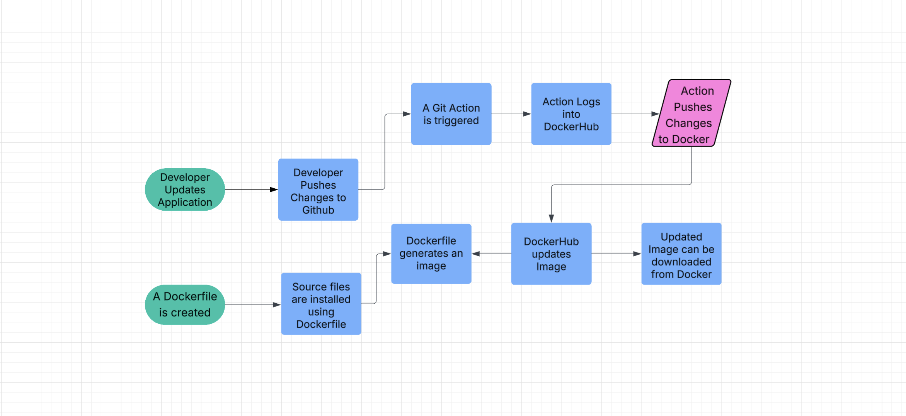

# Project 4 CI 
## Part 1 - Dockerize it
### Project Overview 
This project uses Docker to containerize an angular application.\
The application requires node:18-bullseye and angular-cli to run.\
A container environment is able to use the required software and code.\
The container can be downloaded to any system using a Docker image.

### Containerizing your Application
Docker can be installed through Docker Desktop.\
Which can be found on the Docker website, and provides an installer for Docker Desktop\
Which automatically installs all dependencies for the command line.\
For my system I downloaded the apple-silicon version of Docker Desktop.

A container can be created without a Dockerfile.\
DockerHub created a tutorial image which can be ran with the following command ...\
`docker run -d -p 80:80 docker/getting-started`\
Which starts a container and open a browser at http://localhost⁠ to go through the tutorial.


The container should be mounted to the directory with the application.\
The mounted container can be started with the command ...\
`docker run -it -p 80:80 -v /[path/to/application]:[desired/path] ubuntu`\
Which creates an ubuntu container with the needed application files.\
The container is also listening on port 80 to host the application.

The ubuntu containers needs all of the desired software installed.\
Which can be performed using `apt install`\
The application requires npm and angular-cli to be installed.

After dependencies are installed, the application can be ran\
By executing the command `ng serve --host 0.0.0.0` in wsu-hg-main.

The Dockerfile contains:
```
FROM node:18-bullseye

RUN apt update 
RUN apt install -y npm
RUN npm install -g @angular/cli

RUN mkdir /build
WORKDIR /build

COPY package.json /build/
COPY angular.json /build/
COPY.json /build/
COPY *.js /build/
COPY README.md /build/
COPY ./src /build/src/

EXPOSE 4200

CMD ["ng", "serve", "--host", "0.0.0.0"]
```
The file tells Docker ...
- FROM: what image to build the container off
- RUN: execute the following command
- WORKDIR: where the app is located
- COPY: copy application files to the container
- EXPOSE: the port being used
- CMD: command to execute the application\

This Dockerfile creates a container from the node:18-bullseye image\
It updates apt to be able to install the correct versions of npm and angular/cli\
The container builds the app files into a directory called build\
The Dockerfile copies all of the required files for the app into the build directory.\
Then it exposes the port 4200 for port forwarding.\
Finally the CMD hosts the website to be available to all IP addresses\


The Dockerfile can be built into an image by running\
`docker build -t [image name] .`\
After the image is built, the container is built by running\
`docker run -d -p 4200:4200 [image name]`\
If successful Docker should begin the container in the background.

This can be checked using the command `docker ps`\
Which shows all active containers.

If the Dockerfile is properly configured.\
The Application can be viewed by typing ...\
`http://localhost:4200/` \
The public Ip address of the host system can replace localhost.\
This allows other users to connect to the webpage.

The public Ip address can be found with the command
`ifconfig`

### Working with Docker Hub
An account must be created for Docker Hub before creating repository.\
A repository can be created through the DockerHub GUI.\
It can be public or private.\
To authenticate Docker Hub in the CLI, the command `Docker login` is ran. \
This will prompt the user to authenticate the account.\
Which can be done through the password or a personal access token from Docker Hub.

An image must be given a tag to push to a docker repoistory.\
An image is tagged with the command \
`docker tag [image name] [path/to/docker/repo]:[tag]`

The image can now be pushed to the Docker repository.\
This is done using the conmand \
`docker push [path/to/docker/repo]:[tag]`\
[Link to Docker Repository](https://hub.docker.com/r/hannahwysong/wysong-ceg3120/tags)

## Part 2 - Github Actions and DockerHub
### Configuring GitHub Repository Secrets:
A Personal Access Token or PAT is generated through github\
In account settings, there is a developer options tab, keys are generated inside here.

Repository secrets can be found in the settings options of a public git repository.\
There is an option to create repository secrets of environment variables.\
These can be used to hide keys or passwords that are needed for git actions.

For example this project uses two secrets:\
`${{ secrets.DOCKER_USERNAME }}`\
 `${{ secrets.DOCKER_TOKEN }}`\
The first secret contains the username for my dockerhub account. \
The second secret contains the dockerhub authentication token.\
Like the PAT, the docker token is generated through docker desktop. 

### CI with GitHub Actions
The workflow is set up to push changes from GitHub to DockerHub.
```
name: ci

on:
  push:
    tags:
      - 'v*'

jobs:
  docker:
    runs-on: ubuntu-latest
    steps:
      - name: Checkout code
        uses: actions/checkout@v4

      - name: Login to Docker Hub
        uses: docker/login-action@v3
        with:
          username: ${{ secrets.DOCKER_USERNAME }}
          password: ${{ secrets.DOCKER_TOKEN }}

      - name: Build and push
        uses: docker/build-push-action@v6
        with:
          context: ./angular-site/angular-bird/wsu-hw-ng-main
          file: ./angular-site/angular-bird/wsu-hw-ng-main/Dockerfile
          push: true
          tags: ${{ secrets.DOCKER_USERNAME }}/wysong-ceg3120:latest
```
The YML file creates a git workflow called ci, which only triggers if tagged with v*\
The workflow job uses the ubuntu image to do the following: \
The Checkout Code step makes sure that it is using the most recent update\
The Login step uses the git secrets to log into my docker hub account. \
The build and push step takes any changes to the Dockerfile and source code\
To the "wysong-ceg3120" docker repository with the tag "latest"

If the angular-bird application is extracted in a different repository\
Then replace the "angular-site" repository name to that name.\
The "context" and "file" provide the path to the work directory and dockerfile\
[Link to workflow file in your GitHub repository](https://github.com/WSU-kduncan/ceg3120-cicd-hannahwysong/actions/runs/14500754968/workflow)
### Testing & Validating
GitHub provides an actions tab on the browser, which contains the results of a workflow\
The overview for each workflow has the job name, commit name and tag, and results of the run.\
A red circle appears next to the workflow if it failed. GitHub also sends the user an email

The image in Dockerhub can be checked by pulling the most recent version after running the workflow.\
Changes to the Dockerfile can be checked by inspecting the image.\
Otherwise, a new container can be ran with the image to check changes made to the application.

## Part 3 - Project Description and Diagram
### Continuous Integration Project Overview
The goal of this project was continuous integration, or an container that stays up to date.\
This project uses DockerHub to build an image of the application files\
The project also uses GitHub to update any changes to the code on DockerHub



### References
- [Container Tutorial](https://docs.docker.com/get-started/workshop/02_our_app/)
- [Exposing ports](https://docs.docker.com/get-started/docker-concepts/running-containers/publishing-ports/)
- [How to push an image](https://docs.docker.com/get-started/introduction/build-and-push-first-image/)
- [How to tag an image](https://docs.docker.com/reference/cli/docker/image/tag/)
- [Update Docker using Git Actions](https://docs.docker.com/build/ci/github-actions/update-dockerhub-desc/)
- [Updating Tags on Github](https://stackoverflow.com/questions/19757770/git-tags-dont-show-up-as-github-releases)
